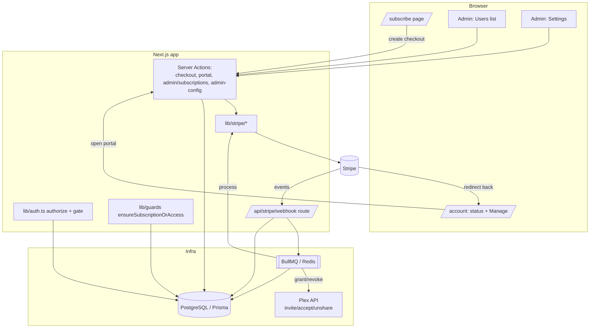
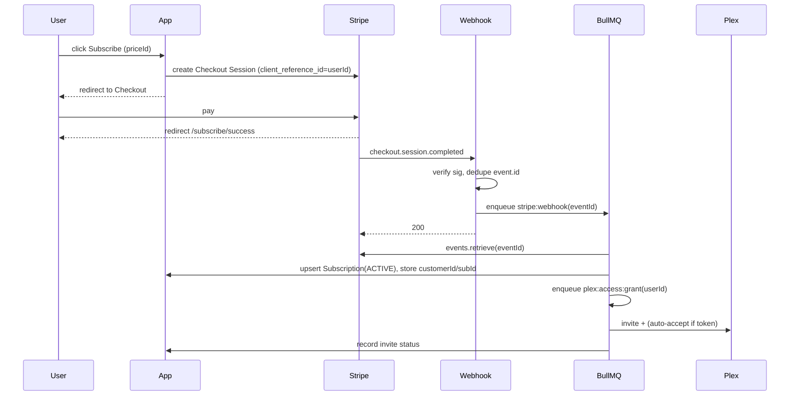
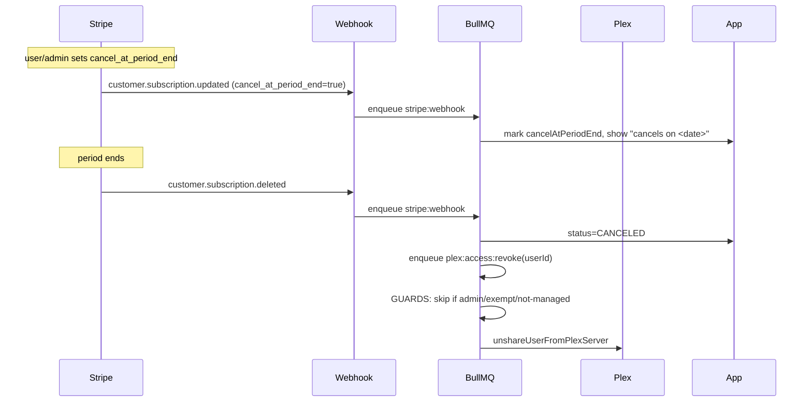

# Detailed Design: Stripe Subscription Integration

**Project:** 2026-07-03-stripe-subscription-integration
**Status:** Design (pre-implementation)
**Author:** PDD session, 2026-07-03

This is a standalone design document. It consolidates the requirements
(idea-honing Q1–Q10 + refinements R1–R10) and research findings into an
implementable architecture. It can be read without the other project files.

---

## 1. Overview

Add an optional, admin-controlled **Stripe subscription** capability to the Plex
management platform. When an admin enables it, Plex users who are **not** members of
the managed server may still authenticate, but are gated to a `/subscribe` page where
they can start a Stripe subscription. A successful subscription **automatically
invites and admits** them to the Plex server; a cancellation (at period end) or final
payment failure **automatically removes** them. Users see their subscription status
in-app and manage it through the Stripe Billing Portal. Admins see and manage
subscriptions from the existing user-list page (no new admin page).

The entire feature is behind a master `stripeEnabled` toggle. **When disabled (the
default), the application behaves exactly as it does today** — non-members are rejected
at login and there is no subscribe flow. This makes the feature safe to ship dark and
enable per-deployment.

### Goals
- Monetize server access via Stripe subscriptions without disrupting existing members.
- Fully automate Plex provisioning/deprovisioning from Stripe subscription lifecycle.
- Keep secrets encrypted, webhooks verified, and side effects idempotent + retryable.
- Reuse existing patterns (Config singleton, BullMQ, Plex invitation helpers, admin
  UI, encryption) rather than introducing parallel machinery.

### Non-goals
- Differentiated tiers mapping to different Plex libraries/quality (binary access only).
- In-app payment/card handling (offloaded to Stripe Checkout + Billing Portal).
- Email/Discord notifications for pending invites (in-app status only for v1).
- One-time payments, metered billing, tax configuration beyond Stripe defaults.

---

## 2. Detailed Requirements

Consolidated and numbered. "Q" = original clarification, "R" = refinement.

### Master toggle & feature gating
- **FR-1 (R4):** A single admin toggle `Config.stripeEnabled` enables/disables the
  entire feature. Default `false`.
- **FR-2 (R4):** When disabled, behavior is identical to today: `lib/auth.ts` throws
  `ACCESS_DENIED` for non-members; no `/subscribe`; the subscription guard is a no-op.
- **FR-3 (R4):** The toggle cannot be enabled until Stripe is fully configured: secret
  key, webhook secret, and ≥1 price ID all present.
- **FR-4 (R4):** Disabling is safe and reversible: no Stripe cancellations, no Plex
  removals. Existing subscribers simply fall back to normal Plex-access rules.

### Authentication & access gate
- **FR-5 (Q3):** When enabled, a Plex-authenticated user who is **not** a server member
  may create a session but is redirected to `/subscribe` until allowed.
- **FR-6 (Q3):** The `ACCESS_DENIED` throw in `lib/auth.ts` is relaxed **only when
  `stripeEnabled === true`** and only for the no-access case (real API failures still
  error).
- **FR-7 (gate rules):** A user is **allowed** into the app when ANY of: Stripe
  disabled; `isAdmin`; `isExempt`; active subscription (`ACTIVE` or `PAST_DUE`).
- **FR-8 (Q9/R1/R2):** Existing members are **grandfathered** via a **SQL data
  migration** that sets `isExempt = true`, `exemptReason = 'grandfathered'` for **all
  existing users** (correct because a `User` row only exists today if
  `checkUserServerAccess` passed at login). Runtime gate is pure-DB; no Plex token
  needed. New users default to `isExempt = false`.

### Subscribe & provisioning
- **FR-9 (Q2/R5/R7):** Admin configures a set of Stripe **price IDs**. `/subscribe`
  fetches display details (amount/currency/interval/product name) live from Stripe.
  Multiple prices may be offered; all grant the same binary access.
- **FR-10 (R6):** Checkout enables promotion codes (`allow_promotion_codes: true`).
- **FR-11 (Q10b):** Checkout binds identity via `client_reference_id = user.id` and
  `metadata.appUserId`, propagated to the subscription. Webhooks map back to the app
  user via this, never by email.
- **FR-12 (Q1):** On `checkout.session.completed`, the app **auto-invites** the user to
  Plex and **auto-accepts** using the user's stored `plexAuthToken`.
- **FR-13 (Q10c/R3):** If auto-accept can't run (missing/expired token), the invite is
  left pending and the app shows an in-app "check your email to accept the Plex invite"
  status. Subscription is active regardless.

### Self-service
- **FR-14 (Q4):** Subscribers see current status (plan, renewal/period-end date, state)
  natively and open the **Stripe Billing Portal** to manage/cancel/update payment.
- **FR-15 (R8):** A canceled/removed user is gated back to `/subscribe` and can
  re-subscribe (a fresh Checkout; the existing canceled `Subscription` row is reused).
- **FR-16 (R9):** A `PAST_DUE` user keeps full access and sees a persistent global
  banner linking to the Billing Portal.

### Cancellation & removal
- **FR-17 (Q6):** Cancellation is **at period end** (`cancel_at_period_end`). Plex
  removal is driven by `customer.subscription.deleted` (fires at period end).
- **FR-18 (Q10a):** During `past_due`/dunning, access is retained; removal only on
  final `canceled`/`unpaid`.
- **FR-19 (Q9 — safety invariant):** Automatic removal must **never** unshare an admin,
  an exempt user, or a user whose access is not Stripe-managed.

### Admin (folded into user-list — Q5/R10)
- **FR-20:** Subscription status column (Active/Past due/Canceled/None + exempt marker)
  with renewal date.
- **FR-21:** Filter by subscription state.
- **FR-22:** Per-user deep link to the Stripe dashboard (customer/subscription).
- **FR-23:** Admin "Cancel subscription" action (cancels at period end via Stripe).
- **FR-24 (R10):** Admin "Grant access (comp)" action: invite + auto-accept + mark
  `isExempt`, `exemptReason='comp'` — independent of Stripe.
- **FR-25:** Admin toggle-exempt action.

### Config & security
- **FR-26 (Q7):** Stripe secret key, webhook secret, price IDs, and `stripeEnabled`
  stored in the encrypted `Config` singleton; edited via admin settings UI.
- **FR-27:** Secret key + webhook secret encrypted at rest (registered in the Prisma
  encryption extension).
- **FR-28 (webhook):** The webhook route verifies the Stripe signature against the raw
  body, dedupes on `event.id`, enqueues a job, and returns 200 quickly.
- **FR-29 (disabled webhook behavior):** While disabled, the webhook still verifies and
  records subscription status but skips Plex side effects.

### Scope
- **FR-30 (Q8):** Full feature delivered in phases, core end-to-end first.

---

## 3. Architecture Overview

### 3.1 Component map



### 3.2 Key flows

**Subscribe → provision:**


**Cancel (period end) → remove:**


---

## 4. Components and Interfaces

### 4.1 `lib/stripe/` (new)
- `client.ts` — `getStripe(): Promise<Stripe | null>` builds a `Stripe` client from
  `Config.stripeSecretKey` (returns null if unconfigured). Avoid hard-pinning
  `apiVersion` unless it matches the installed SDK (research caveat).
- `config.ts` — `getStripeConfig()` returns `{ enabled, hasSecret, hasWebhookSecret,
  priceIds }` from Config (secret values not leaked to client components).
- `prices.ts` — `getOfferedPrices()` → for each configured priceId,
  `stripe.prices.retrieve(id, { expand: ['product'] })`; cache briefly; skip+log
  invalid ids. Returns `{ priceId, amount, currency, interval, productName }[]`.
- `checkout.ts` — `createCheckoutSession(userId, priceId)` →
  `stripe.checkout.sessions.create({ mode:'subscription', line_items:[{price,quantity:1}],
  client_reference_id:userId, subscription_data:{metadata:{appUserId:userId}},
  allow_promotion_codes:true, success_url, cancel_url, customer_email })`.
- `portal.ts` — `createPortalSession(userId)` → looks up `stripeCustomerId`,
  `stripe.billingPortal.sessions.create({ customer, return_url })`.
- `events.ts` — `mapStripeStatus(stripeStatus): SubscriptionStatus`; helpers to read
  period-end (version-safe).

### 4.2 Server Actions
- `actions/subscription.ts` (user-facing): `startCheckout(priceId)` (auth required, gate
  NOT required — accessible while gated), `openBillingPortal()`.
- `actions/admin/admin-config.ts` (extend): `updateStripeSettings({secretKey?,
  webhookSecret?, priceIds})`, `setStripeEnabled(enabled)` (validates full config
  before allowing `true`).
- `actions/admin/subscriptions.ts` (new, `requireAdmin()`): `adminCancelSubscription(userId)`,
  `adminGrantAccess(userId)` (invite+comp), `adminToggleExempt(userId, reason?)`.

### 4.3 Webhook route
- `app/api/stripe/webhook/route.ts`: `export const dynamic='force-dynamic'`;
  `POST(req)` → `rawBody = await req.text()`; verify with
  `stripe.webhooks.constructEvent`; if `event.id` already in `StripeEvent` → 200
  (dedupe); else `addJob(STRIPE_WEBHOOK, { eventId }, { jobId: event.id })`; 200. Apply
  a rate limiter; NO admin auth (Stripe signature is the auth). 400 on bad signature.

### 4.4 BullMQ jobs (`lib/queue/jobs/stripe.ts` new)
- Job types added to `lib/queue/types.ts`: `STRIPE_WEBHOOK`, `PLEX_ACCESS_GRANT`,
  `PLEX_ACCESS_REVOKE` with payload/result types + `JobPayloadMap`/`JobResultMap`
  entries; register in `lib/queue/jobs/index.ts`.
- `processStripeWebhook(job)`: retrieve event by id; persist `StripeEvent`; on
  `checkout.session.completed` → upsert Subscription + enqueue GRANT (unless disabled);
  on `customer.subscription.updated` → sync status/period/cancelAtPeriodEnd; on
  `customer.subscription.deleted` → status CANCELED + enqueue REVOKE (unless disabled);
  on `invoice.payment_failed` → status PAST_DUE.
- `processPlexAccessGrant(job)`: load active PlexServer + user; invite; auto-accept if
  token; record invite status (pending on failure — do not throw).
- `processPlexAccessRevoke(job)`: **guards first** (skip admin/exempt/non-managed/past_due);
  then unshare; update status/log.

### 4.5 UI
- `/subscribe` (outside `(app)` guard): lists offered prices (from `getOfferedPrices`),
  Subscribe buttons → `startCheckout`. Loading via `LoadingSpinner`. If Stripe disabled
  → 404/redirect home.
- `/subscribe/success`: shows provisioning/invite status.
- Account/status surface: current subscription + "Manage subscription" (portal).
- Admin settings: new **Stripe** card (secret/webhook `StyledInput type=password`,
  price IDs input, master `Switch`; enable disabled until configured).
- Admin users list: new Subscription column (`Badge`), subscription filter
  (`StyledDropdown`), row actions (Cancel/Grant/Toggle-exempt via `ConfirmModal`),
  "View in Stripe" link.
- New primitives: `components/ui/switch.tsx`, `components/ui/alert.tsx`. Past-due banner
  (R9) + pending-invite notice (R3) use `Alert`, surfaced from `(app)` layout.
- Guard: `lib/guards.ts` `ensureSubscriptionOrAccess()` called in `app/(app)/layout.tsx`
  after `ensureOnboardingComplete()`.

---

## 5. Data Models

```prisma
enum SubscriptionStatus { ACTIVE PAST_DUE CANCELED INCOMPLETE UNPAID }

model Subscription {
  id                   String             @id @default(cuid())
  userId               String             @unique
  user                 User               @relation(fields: [userId], references: [id], onDelete: Cascade)
  stripeCustomerId     String?            @unique
  stripeSubscriptionId String?            @unique
  status               SubscriptionStatus @default(INCOMPLETE)
  priceId              String?
  currentPeriodEnd     DateTime?
  cancelAtPeriodEnd    Boolean            @default(false)
  canceledAt           DateTime?
  plexInviteStatus     String?            // 'sent' | 'accepted' | 'pending'
  createdAt            DateTime           @default(now())
  updatedAt            DateTime           @updatedAt
  @@index([status])
  @@index([stripeCustomerId])
}

model StripeEvent {   // webhook idempotency
  id          String   @id      // Stripe event.id
  type        String
  processedAt DateTime @default(now())
  @@index([type])
}

model User {          // additions
  // ...existing...
  isExempt     Boolean       @default(false)
  exemptReason String?       // 'grandfathered' | 'comp' | null
  subscription Subscription?
  @@index([isExempt])
}

model Config {        // additions
  // ...existing...
  stripeEnabled       Boolean @default(false)
  stripeSecretKey     String? // ENCRYPTED
  stripeWebhookSecret String? // ENCRYPTED
  stripePriceIds      String? // JSON array of price ID strings
}
```
- Register `Config: ['stripeSecretKey','stripeWebhookSecret']` in `ENCRYPTED_FIELDS`
  (`lib/prisma.ts`).
- Migration committed via `npm run db:migrate -- --name add_stripe_subscriptions`.
- Status mapping: Stripe `active|trialing`→ACTIVE; `past_due`→PAST_DUE; `canceled`→
  CANCELED; `incomplete|incomplete_expired`→INCOMPLETE; `unpaid`→UNPAID.
- `AdminUserWithWrappedStats` (`types/admin.ts`) extended with `subscriptionStatus`,
  `currentPeriodEnd`, `cancelAtPeriodEnd`, `isExempt`, `exemptReason`,
  `stripeCustomerId`.

---

## 6. Error Handling

- **Webhook signature invalid** → 400, no enqueue, log warn. (Do not 500; Stripe
  retries 5xx.)
- **Duplicate event** (`event.id` seen) → 200, no-op.
- **Job failures** (Plex API/DB) → throw to trigger BullMQ retry (3× exp backoff).
  Idempotency: GRANT/REVOKE re-check current DB/subscription state before acting.
- **Auto-accept failure** (FR-13) → do NOT throw; record `plexInviteStatus='pending'`;
  surface in-app. GRANT job still "succeeds."
- **Removal guards** (FR-19) → if a REVOKE job targets an admin/exempt/non-managed
  user, skip with a logged reason and success (defensive; should never happen).
- **Stripe unconfigured / disabled** → `getStripe()` returns null; user actions return
  `{error}`; `/subscribe` unavailable; webhook still verifies+records but skips Plex
  side effects (FR-29).
- **Enable blocked** (FR-3) → `setStripeEnabled(true)` returns `{error}` listing missing
  config; UI greys the toggle.
- **Price id no longer in Stripe** → skip in `getOfferedPrices`, log; never crash
  `/subscribe`.
- **Period-end field absence** (API-version caveat) → helper returns null; UI shows
  "renews soon" fallback rather than crashing.
- **Auth**: relaxation is conditional on `stripeEnabled`; real Plex API failures at
  sign-in still error (unchanged).

---

## 7. Testing Strategy

TDD, following existing conventions (`__tests__` colocation, `jest.mock('@/lib/prisma')`,
mocked `getServerSession`/`revalidatePath`, `useToast` spies, `Request` for routes).
Extend `__tests__/utils/test-builders.ts` with `makePrismaSubscription`, a Stripe event
fixture, and subscription fields on `makeAdminUserWithStats`.

- **lib/stripe**: unit-test `mapStripeStatus`, `getOfferedPrices` (mock `stripe.prices`),
  checkout/portal param assembly (mock `stripe.*.create`), `getStripe` null-when-unconfigured.
- **Auth gate**: mock `checkUserServerAccess` + `getConfig`; assert disabled→throws
  ACCESS_DENIED (today's behavior), enabled+no-access→no throw. `getAccessGateStatus`
  truth table (disabled/admin/exempt/active/past_due/none).
- **Guard**: `ensureSubscriptionOrAccess` redirects only when not allowed.
- **Webhook route**: mock `constructEvent` (valid/invalid), `addJob`, `StripeEvent`
  dedupe; assert 400 on bad sig, 200 + enqueue on valid, 200 no-op on duplicate.
- **Jobs** (new BullMQ test pattern — processors as plain functions): 
  - GRANT: invite called; auto-accept when token; pending (no throw) when not.
  - REVOKE **guard tests (highest value)**: never unshare admin/exempt/non-managed/
    past_due; unshare only for canceled managed non-exempt.
  - webhook processor: each event type → correct Subscription mutation + enqueue; skips
    Plex side effects when disabled.
- **Server actions**: admin cancel/grant/toggle-exempt (requireAdmin, Prisma/Stripe
  mocks, `{success}`/`{error}`); config update + enable-blocked-until-configured.
- **Components**: `/subscribe` (renders prices, calls startCheckout, loading),
  Stripe settings card (enable disabled until configured, password inputs), user-list
  column/filter/actions (Badge states, ConfirmModal, toasts), `Switch`, `Alert`.
- **E2E (Playwright, later phase)**: gated non-member redirected to `/subscribe`;
  admin enables Stripe; status column shows; use `data-testid` throughout. Stripe
  itself mocked/stubbed (test mode) — full payment E2E out of scope for CI.

---

## 8. Appendices

### 8.1 Technology choices
- **Stripe Checkout + Billing Portal (hosted)** over custom billing UI: minimal
  PCI/code surface, fastest path, matches "status + portal" decision. Trade-off: less
  control over the exact payment UI.
- **Webhooks + BullMQ** over synchronous webhook processing: reliability, retries,
  fast 200s (Stripe best practice). Reuses existing queue.
- **Config singleton + encryption** over env vars: in-app admin config without
  redeploy, consistent with LLM provider/API-key pattern, secrets encrypted at rest.
- **Pure-DB gate + exempt backfill** over live Plex checks per request: latency and
  decoupling from Plex availability; cost is a one-time backfill step.
- **Re-fetch event by id in job** over trusting enqueued payload: acts on Stripe's
  current truth, tiny queue payloads.

### 8.2 Key research findings
- Stripe SDK `^22.x`, API version `2026-06-24.dahlia`; avoid hard-pinning `apiVersion`
  in Node (TS-type caveat) — verify against installed SDK at build time.
- `current_period_end` location is API-version-sensitive (may be on subscription
  items) — read defensively.
- Events: `checkout.session.completed`, `customer.subscription.updated/deleted`,
  `invoice.payment_failed`. `deleted` fires at period end for `cancel_at_period_end`.
- No middleware in the app; gating is layout/guard-based. No reusable Switch/Alert/
  Skeleton in `components/ui/`. BullMQ currently untested.
- Plex helpers exist: `inviteUserToPlexServer({url,token}, email)`,
  `acceptPlexInvite(userToken, inviteID)`, `unshareUserFromPlexServer({url,token},
  plexUserId)`. Active server via `prisma.plexServer.findFirst({where:{isActive:true}})`.

### 8.3 Alternatives considered (and rejected)
- **Stripe Payment Links** (no code checkout): rejected — can't reliably bind
  `client_reference_id` per user / customize success flow as needed.
- **Everyone must subscribe (no grandfathering)**: rejected by product (Q9) — risks
  removing existing friends/family.
- **Immediate cancellation**: rejected (Q6) — users lose paid time.
- **Subscription status in JWT**: rejected — stale-access windows unacceptable for
  billing; per-request DB gate is cheap and correct.
- **Stripe config as a setup-wizard step**: rejected — it's optional; a required step
  would gate setup completion.

### 8.4 Open items to confirm at build time
1. Installed `stripe` SDK version + whether to set `apiVersion`.
2. Exact period-end field path for that version.
3. Whether to set the webhook endpoint's API version to match the SDK.

### 8.5 Decisions finalized during design review
- **Grandfathering = SQL data migration** setting all existing users exempt
  (`exemptReason='grandfathered'`), run in the same migration that adds the columns.
  Justified because existing `User` rows imply prior server access. No runtime backfill.
- **New shared primitives approved:** `components/ui/switch.tsx` and
  `components/ui/alert.tsx`.
