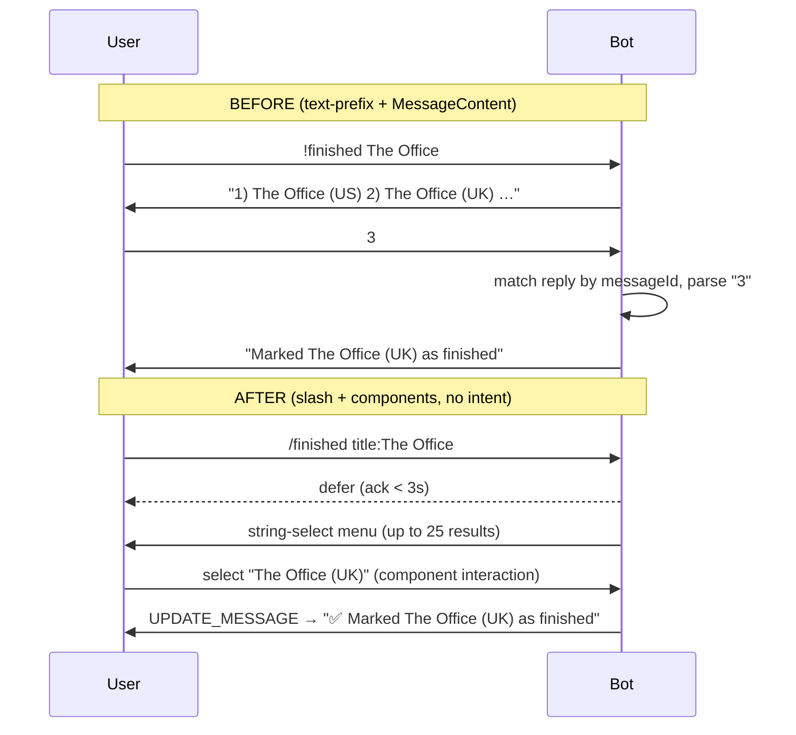
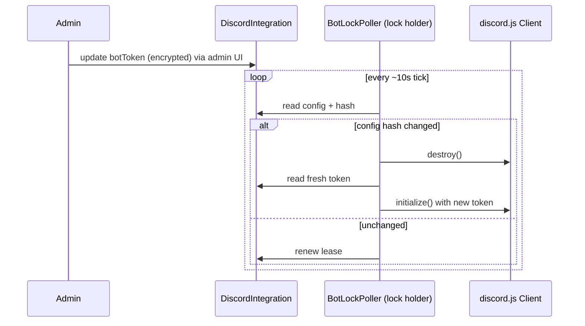

# Detailed Design — Discord Enhancements

_Plex Manager · 2026-07-04 · derived from `rough-idea.md`, `idea-honing.md`
(12 decisions), and the four `research/` documents._

---

## 1. Overview

This effort refactors and modernizes the Plex Manager Discord subsystem to
achieve four goals stated in the rough idea — **refactor**, **more features**,
**better security**, and **more visibility for users on the server** — delivered
as **independently shippable phases**.

The unifying architectural move is a **migration from `!`-prefix text commands to
native Discord slash commands + message components**, which lets us **remove the
`MessageContent` privileged intent** (the single biggest privacy win) while
simultaneously enabling richer UX (select-menu/button media picker, embeds) and a
cleaner command-dispatch architecture. The AI assistant moves to **DM-based
conversation** (DM content is delivered without the privileged intent), so the
bot **remains a gateway process** and the existing **distributed lock is retained
and hardened** (deployment is multi-instance/k8s). New user-facing value is
delivered **in Discord** as personal self-service commands (`/mystats`,
`/mymarks`, `/watching`). Security work centers on **PII/data-leak prevention** (a
single tool registry with per-tool allowlist scrubbing and fail-closed execution)
and **moving the bot token to the encrypted DB** with admin-UI management and
rotation.

Non-goals for this effort (explicitly deferred): in-app (Next.js) user pages,
year-round in-app watch stats, in-Discord community/leaderboard features,
`/request` (Overseerr from Discord), announcements/notifications, expanding Linked
Roles metadata, and a gateway-less HTTP-interactions model.

---

## 2. Detailed Requirements

Consolidated from `idea-honing.md`. Functional requirements (FR) and
non-functional requirements (NFR) are numbered for traceability into the
implementation plan.

### 2.1 Scope & phasing
- **FR-1** Deliver all four goals in one design, sequenced into shippable phases:
  Phase 0 bugs → Phase 1 refactor foundation → Phase 2 slash/component migration →
  Phase 3 security → Phase 4 visibility. Each phase leaves the app releasable.
- **NFR-1** Every phase keeps the build green and existing tests passing (golden
  regression). Import paths preserved via barrels during refactors.

### 2.2 Slash-command migration & privileged intent
- **FR-2** Migrate **all** user commands to native Discord **slash commands**,
  registered via deploy-time bulk-overwrite. Final inventory:
  - `/help [command]` (embed; `command` option autocomplete) — replaces
    `!help`/`!commands`.
  - `/mark <finished|keep|notinterested|rewatch|badquality> title:<text>` — one
    command with **subcommands** (A13), replaces the five `!`-mark commands.
  - `/assistant [prompt]` — deferred inline answer, points to DM for multi-turn
    (FR-5); `/assistant reset` clears context (A14).
  - `/mystats`, `/mymarks [type]`, `/watching` — new self-service (FR-15).
- **FR-3** Replace the "reply with 1–5" media-selection flow with **message
  components** (string select menu or buttons) using the interaction response
  model (defer within 3s where work is slow; `UPDATE_MESSAGE` to collapse the
  picker into a confirmation).
- **FR-4** Remove the **`MessageContent` privileged intent** from the gateway
  client once no code path depends on reading arbitrary channel message text.
- **NFR-2** After FR-4, the only message content the bot receives is: its own
  messages, **DMs to the bot**, @-mentions of the bot, and message-context-menu
  targets (none of which require the privileged intent).

### 2.3 Assistant conversational UX
- **FR-5** The AI assistant operates as a **DM-based conversation**: a verified
  user DMs the bot and receives multi-turn, context-retaining replies. A
  `/assistant [prompt]` slash command in a guild starts/points to the DM.
- **FR-6** DM handling requires a **gateway connection** with the non-privileged
  `DirectMessages` (+ `Guilds`, `MessageContent` for DMs is NOT required — DM
  content is exempt) intent set; the bot stays a persistent gateway process.
- **NFR-3** Because the bot remains a singleton gateway process, the
  **distributed lock is retained**; a pure HTTP-interactions (gateway-less) model
  is explicitly rejected (conflicts with FR-5/FR-6).

### 2.4 Deployment
- **NFR-4** Target **multi-instance / k8s**: exactly one replica runs the gateway
  bot at a time (lock holder); lock correctness under concurrency and a clean
  **token-rotation bounce** across pods are required.

### 2.5 Security (priority order)
- **FR-7** (priority 1 — PII/leak) Establish a **single tool registry** as the
  source of truth for chatbot tools, each tagged `discordSafe` and `userScoped`;
  derive the Discord-safe set from it (delete the parallel hand-maintained list).
- **FR-8** Apply **per-tool allowlist scrubbing** of tool outputs in the Discord
  context **before the LLM sees them** (keep only declared safe fields). Denylist
  regex (`chat-safety.ts`, hardened) remains a final backstop.
- **FR-9** Add a **fail-closed runtime check** in the Discord execution path: a
  tool not in the resolved safe set cannot execute (blocks prompt-injection).
- **FR-10** Fix the **unscoped `get_tautulli_users`** exposure and remove its
  mention from the Discord system prompt.
- **FR-11** Close the **dormant `clientSecret` leak** in `getDiscordStats`
  (apply `omitSecret` / column projection).
- **FR-12** (priority 2 — bot token) Move `DISCORD_BOT_TOKEN` and support-channel
  IDs from plaintext env to the **encrypted DB** (`DiscordIntegration`), managed
  in the admin UI, with `ENCRYPTED_FIELDS` coverage and **blank-means-keep**.
- **FR-13** Support **token rotation** via the lock-poller **bounce**
  (`destroy()` + re-`initialize()`) on the lock-holding pod when config changes.
- **NFR-5** Env vars act as a **null-fallback** for the token/channel config so
  existing deployments upgrade without forced reconfiguration (optional per A8,
  implemented since it's low-cost).
- **FR-14** (priority 3 — lower) Add Discord **audit events** (config change,
  link, unlink, token rotation, command denied) and **rate-limit** OAuth state
  creation; **authorization tiers** (gate server-wide tools on `isAdmin`).

### 2.6 Visibility (in-Discord, personal)
- **FR-15** Add personal self-service slash commands, all **hard-scoped to the
  requesting user** and replied **ephemerally or via DM**:
  - `/mystats` — the user's own watch stats (embed).
  - `/mymarks` — the user's own media marks (embed/paginated).
  - `/watching` — the user's own current Plex/Tautulli sessions.
- **NFR-6** All visibility output is routed through the allowlist scrubber /
  denylist backstop; no other user's data is ever exposed.
- **FR-16** Out of scope: in-app pages, year-round in-app stats, community/
  leaderboard, named leaderboards.

### 2.7 Features
- **FR-17** "More features" is satisfied by FR-15 (self-service) + FR-3 (richer
  component/embed UX). **No** `/request`, **no** announcements.

### 2.8 Compatibility
- **NFR-7** Clean break on the **command interface** is acceptable (no `!`-command
  grace period). Release notes document the change.
- **NFR-8** Schema changes are **additive**; existing `DiscordConnection`,
  `UserMediaMark`, and `DiscordCommandLog` data is preserved.

### 2.9 Support flow
- **FR-18** Retire passive support-channel monitoring. Support = **DM the
  assistant** + a **`/help`** slash command; a pinned/channel post explains how to
  get help.

### 2.10 Linked Roles
- **FR-19** Keep the 2 existing metadata fields (`is_subscribed`,
  `watched_hours`); only refactor `computeRoleMetadata` and resolve the
  `is_subscribed` TODO. No re-registration.

### 2.11 Testing
- **NFR-9** Strong **unit + regression** coverage: every extracted module
  unit-tested; refactors keep existing suites green; new command handlers get
  handler-level tests; correctness-critical fixes (session race, tool-safety
  fail-closed, PII scrubbing) explicitly tested. **No new E2E.**

---

## 3. Architecture Overview

### 3.1 Target module architecture

```mermaid
flowchart TD
  subgraph Gateway["Gateway process (single lock holder)"]
    Client["discord.js Client\nintents: Guilds, DirectMessages\n(NO MessageContent)"]
    Client -->|InteractionCreate| IR["interaction-router.ts"]
    Client -->|MessageCreate (DM only)| DMR["dm-router.ts (assistant)"]
  end

  IR --> REG["commands/registry.ts\nSlashCommand[] (matches/handle)"]
  REG --> CMDS["command handlers\nhelp · mark · mystats · mymarks · watching · assistant"]
  DMR --> CHAT["chat-session.ts + assistant"]

  CMDS --> AW["audit-wrapper.ts\nwithAuditLog()"]
  CHAT --> AW
  AW --> AUDIT["audit/write.ts → DiscordCommandLog"]

  CMDS --> SVC["services / verifyDiscordUser"]
  CHAT --> ASST["lib/chatbot/assistant.ts"]
  ASST --> TOOLREG["tools/registry.ts\n(single source, discordSafe/userScoped)"]
  TOOLREG --> EXEC["executors/* + allowlist scrubber (FR-8)\nfail-closed check (FR-9)"]

  subgraph Lifecycle["Process lifecycle (instrumentation/node.ts)"]
    POLL["lock/poller.ts (BotLockPoller)"]
    LEASE["lock/lease.ts (DistributedLock)"]
    POLL --> LEASE
    POLL -->|onAcquired/onLost + config-change| Client
  end

  CMDS --> INTG["integration.ts (OAuth)"]
  INTG --> ROLE["role-metadata.ts computeRoleMetadata"]
  INTG --> API["api.ts (Discord REST)"]

  CFG[("DiscordIntegration\n+ botToken (ENCRYPTED)\n+ channel IDs")] --> Client
  CFG --> POLL
```

### 3.2 Media-selection UX: before → after



### 3.3 Token rotation bounce (multi-pod)



### 3.4 Key architectural decisions
- **Gateway retained, not HTTP-webhook.** DM assistant (FR-5) needs gateway
  events; the gateway also carries slash-command interactions, so one connection
  serves both. The lock (NFR-3/NFR-4) stays and is hardened.
- **Single tool registry** is the security keystone (FR-7): tools carry
  `discordSafe`/`userScoped` flags; the Discord toolset, prompt tool list, and
  scrubbing rules all derive from it — no drift, decisions reviewable in one diff.
- **Command registry** replaces the 380-line `MessageCreate` monolith; a slash
  command is one registry entry, making future features (deferred `/request`,
  etc.) cheap.
- **Additive schema.** New `DiscordPendingSelection` table + `DiscordIntegration`
  columns; nothing dropped (NFR-8).

---

## 4. Components and Interfaces

### 4.1 Bot core & routing (refactor of `bot.ts` 608 → ~120)
- `lib/discord/bot.ts` — `DiscordBot` shell: `initialize()`, `destroy()`,
  `setupEventHandlers()`. Intents: `Guilds`, `DirectMessages` (no
  `MessageContent`). Constructor accepts an injected `Client` (testability;
  removes the `getDiscordBot()` singleton).
- `lib/discord/routing/interaction-router.ts` — `routeInteraction(interaction)`:
  type-guards (`isChatInputCommand`/`isStringSelectMenu`/`isButton`), verify user,
  dispatch via the command registry, wrap in `withAuditLog`.
- `lib/discord/routing/dm-router.ts` — handles DM `MessageCreate` for the
  assistant only (verify → `chat-session` → assistant → reply).
- `lib/discord/routing/audit-wrapper.ts` — `withAuditLog(params, fn)`: single
  create→SUCCESS/FAILED lifecycle (kills 5× duplication).
- `lib/discord/commands/registry.ts` —
  ```ts
  interface SlashCommand {
    data: SlashCommandBuilder            // for registration
    commandType: DiscordCommandType      // for audit
    handle(ctx: InteractionContext): Promise<void>
  }
  export const COMMANDS: SlashCommand[]
  ```
- `scripts/register-discord-commands.ts` — deploy-time bulk-overwrite
  (`REST.put(Routes.applicationGuildCommands|applicationCommands, {body}})`),
  building `body` from `COMMANDS.map(c => c.data.toJSON())`. Complements the
  existing `register-discord-metadata.ts` (unchanged, FR-19).

### 4.2 Command handlers
Each is a `SlashCommand` registry entry:
- `commands/help.ts` — `/help [command]`; reuses `COMMAND_REGISTRY` help text,
  now rendered as an embed; `command` option uses autocomplete.
- `commands/mark/index.ts` — **`/mark` with subcommands** `finished`, `keep`,
  `notinterested`, `rewatch`, `badquality` (A13), each with a `title` option →
  search → component picker → `applyMark` (`finished` also syncs Plex watched).
- `commands/mystats.ts` — `/mystats` (FR-15): `fetchTautulliStatistics(user)` →
  embed; ephemeral.
- `commands/mymarks.ts` — `/mymarks [type]` (FR-15): `getUserMediaMarks`
  (already self-scoped) → embed/paginated; ephemeral.
- `commands/watching.ts` — `/watching` (FR-15): user's own sessions via
  Plex/Tautulli scoped executors; ephemeral.
- `commands/assistant.ts` — `/assistant [prompt]` (FR-5): answers inline
  (deferred) and/or points to DM for multi-turn; **`/assistant reset`** clears
  the DM conversation context (A14). The DM router also honors a `reset`/`clear`
  keyword. The idle-timeout session expiry remains the automatic fallback.

### 4.3 Media marking (refactor of `commands/media-marking.ts` 458 → ~150)
- `lib/discord/commands/mark/pending-store.ts` — replaces the in-memory
  `pendingSelections` Map with a `DiscordPendingSelection` table:
  `create / findByCustomId / delete / gcExpired` (opportunistic GC on read, like
  `DiscordOAuthState`). Survives redeploys; keyed by component `custom_id`.
- `lib/discord/media/mark-media.ts` — shared `applyMark({userId, item, markType,
  markedVia, channelId?})`: the `userMediaMark.upsert` + Radarr/Sonarr matching +
  optional Plex watch. Used by BOTH the slash handler and the chatbot executor
  (deletes ~100-line dup).
- `lib/discord/media/mark-labels.ts` — one copy of label formatting.

### 4.4 Chatbot tool registry & safety (FR-7/8/9/10)
- `actions/chatbot/tools/types.ts` —
  ```ts
  interface RegisteredTool extends ChatTool {
    discordSafe?: boolean
    userScoped?: boolean
    /** Discord-context output allowlist: keys kept before the LLM sees them. */
    discordFields?: string[]
  }
  ```
- `actions/chatbot/tools/{plex,tautulli,sonarr,radarr,overseerr,media-marking}.ts`
  — per-service tool arrays tagged with flags + `discordFields`.
- `actions/chatbot/tools/registry.ts` — `ALL_TOOLS`; `TOOLS` (flags stripped for
  the LLM); `DISCORD_SAFE_TOOLS = ALL_TOOLS.filter(t => t.discordSafe)`;
  `DISCORD_SAFE_TOOL_NAMES`. **Deletes** `DISCORD_SAFE_TOOL_NAME_LIST`.
- `actions/chatbot/prompts/{default,discord}-system-prompt.ts` — prompt bodies;
  tool lists generated from the registry (no hardcoded names). Removes
  `get_tautulli_users` from the Discord prompt (FR-10).
- `actions/chatbot/executors/scrub.ts` — `scrubForDiscord(toolName, output)`:
  allowlist-projects the output to `discordFields` (FR-8). Applied in the executor
  dispatch when `context === "discord"`.
- Executor dispatch (`executors/index.ts`) — **fail-closed** (FR-9): if
  `context === "discord"` and the tool ∉ `DISCORD_SAFE_TOOL_NAMES`, refuse.
- Bug fix (FR-10 / Phase 0): `get_tautulli_library_stats` calls a real stats
  endpoint (add `getTautulliLibrariesTable` to `lib/connections/tautulli.ts` if
  missing); `get_tautulli_users` gated `userScoped`, excluded from Discord.

### 4.5 Chat session (refactor of `services.ts` 332 → ~180; race fixes)
- `lib/discord/chat-session.ts` — `getOrCreateSession(...)` in a `$transaction`
  (atomic, using `@@unique([discordUserId, discordChannelId])`); `appendTurn(...)`
  re-reads + appends the `messages` JSON inside a transaction (fixes the
  clobbering read-modify-write).
- `lib/discord/chat-history.ts` — pure `coerceHistory`/`trimHistory`/`HISTORY_LIMIT`.
- `lib/discord/services.ts` — `verifyDiscordUser` (already returns `isAdmin` for
  FR-14 tiers) + orchestration only.

### 4.6 Audit (refactor of `audit.ts` 861 → modules ≤150)
- `lib/discord/audit/write.ts` — create/update/logCommandExecution.
- `lib/discord/audit/query-helpers.ts` — `dateRangeWhere`, `countByStatus` (one
  `groupBy(['status'])`), date bucketing via `$queryRaw date_trunc`.
- `lib/discord/audit/metrics/{activity,commands,users,errors}.ts` — per-metric
  readers; `getCommandStats` rewritten to a single grouped query (kills N+1).
- `lib/discord/audit/index.ts` — barrel (callers unchanged). Result interfaces
  colocated with their functions.

### 4.7 OAuth / integration (refactor of `integration.ts` 462 → ~300)
- `lib/discord/role-metadata.ts` — `computeRoleMetadata(user)` (FR-19); calls a
  shared `resolvePlexAccess(user)`.
- `lib/discord/oauth-state.ts` (optional) — `consumeOAuthState` + cleanup;
  add per-user pending-state cap + `checkRateLimit` on `/discord/connect` (FR-14).
- `getDiscordStats` — `omitSecret`/projection (FR-11).

### 4.8 Distributed lock (refactor of `lock.ts` 406 → facade ~60 + classes)
- `lib/discord/lock/lease.ts` — `DistributedLock` class (acquire/renew/release/
  isHeld; `INSTANCE_ID` + durations as ctor params).
- `lib/discord/lock/poller.ts` — `BotLockPoller` (owns single loop; renewal driven
  off the same lock object; `onAcquired`/`onLost`; **config-hash change → bounce**
  for FR-13).
- `lib/discord/lock.ts` — thin facade preserving the function names used by
  `instrumentation/node.ts` + `discord-activity.ts`.
- `lib/instrumentation/node.ts` — constructs the poller, injects the `DiscordBot`.

### 4.9 Config & admin (FR-12)
- `DiscordIntegrationForm.tsx` / `discordIntegrationSchema` — add `botToken`
  (password, blank-means-keep), `supportChannelId`, `supportThreadIds`.
- `actions/admin/admin-settings.ts` — `omitSecret(..., "botToken", "hasBotToken")`.
- `actions/discord.ts` — blank-means-keep for `botToken` (mirror `clientSecret`);
  emit `DISCORD_INTEGRATION_CONFIG_CHANGED` audit (FR-14).

### 4.10 Shared prerequisite
- `lib/connections/plex-config.ts` — `getActivePlexServerConfig()` returning
  `{ name, url, token, publicUrl, adminPlexUserId }`; adopted in all 4 duplicate
  sites (executors/plex, executors/media-marking, integration, mark handlers).

---

## 5. Data Models

All changes are **additive** (NFR-8). Prisma + PostgreSQL.

### 5.1 `DiscordIntegration` — new columns (FR-12)
```prisma
model DiscordIntegration {
  // …existing…
  botToken          String?   // ENCRYPTED (add to ENCRYPTED_FIELDS)
  supportChannelId  String?
  supportThreadIds  Json?     // string[]
  configVersion     Int       @default(0) // bumped on change → poller bounce (FR-13)
}
```
- `ENCRYPTED_FIELDS.DiscordIntegration = ['clientSecret', 'botToken']`
  (`lib/prisma.ts`).
- `configVersion` (or a hash of token+channels) is what the poller compares each
  tick to detect a change.

### 5.2 `DiscordPendingSelection` — new model (§4.3)
```prisma
model DiscordPendingSelection {
  id             String   @id @default(cuid())
  discordUserId  String
  channelId      String
  customId       String   @unique  // component custom_id for routing
  markType       MarkType
  results        Json     // up to 25 search results
  createdAt      DateTime @default(now())
  expiresAt      DateTime
  @@index([discordUserId, channelId])
  @@index([expiresAt])
}
```

### 5.3 Unchanged / preserved
- `DiscordConnection`, `UserMediaMark`, `DiscordCommandLog`, `DiscordChatSession`
  (`@@unique([discordUserId, discordChannelId])` enables §4.5 atomicity),
  `DiscordOAuthState`, `DiscordBotLock` — all retained.
- Linked Roles metadata (`is_subscribed`, `watched_hours`) — unchanged (FR-19).

---

## 6. Error Handling

- **Interaction timing:** every handler acks within 3s; slow work (Tautulli/Plex/
  LLM) uses **deferred** responses then `editReply`. Errors → ephemeral message,
  never a raw stack; logged via `createLogger('discord-*')`.
- **Fail-closed tool safety (FR-9):** unknown/unsafe tool in Discord context →
  refuse + audit `DISCORD_COMMAND_DENIED`; never execute.
- **Scrubbing (FR-8):** allowlist projection cannot throw on unexpected shapes —
  unknown keys are dropped, not passed through. Denylist regex backstop on final
  text.
- **Token rotation (FR-13):** if re-`initialize()` fails after a bounce, the
  poller logs, releases the lease (so another pod can try), and retries next tick;
  it never leaves a half-initialized client.
- **Lock:** lease renewal failure → mark not-held, stop the bot cleanly; single
  source of lock truth prevents the two-timer inconsistency.
- **OAuth:** rate-limit exceeded → friendly error; state expired/consumed →
  existing single-use handling; redirect sanitization retained.
- **Server actions:** continue returning `{ error }` objects (no throwing),
  validating inputs with Zod at the boundary.
- **PII degradation:** reuse the existing "_(Personal details were removed for
  privacy.)_" pattern when scrubbing/backstop fires.

---

## 7. Testing Strategy

Per NFR-9 — **strong unit + regression, no new E2E**.

- **Golden regression:** keep `audit.test.ts`, `media-marking.test.ts`,
  `help.test.ts` green across refactors; split `audit.test.ts` to match new
  modules in the same PR as the split.
- **New unit tests (by module):**
  - `tools/registry.ts` — drift guard: every `discordSafe` tool resolves, is
    `userScoped`-handled or inherently global, and `DISCORD_SAFE_TOOLS ⊆ ALL_TOOLS`.
  - `executors/scrub.ts` — allowlist projection keeps only `discordFields`; PII
    keys (email/username/user_id/ip) never survive.
  - fail-closed dispatch — unsafe tool in Discord context is refused.
  - `chat-history.ts` — malformed JSON, wrong roles, missing timestamps.
  - `chat-session.ts` — atomic get-or-create + append under simulated concurrency
    (no duplicate `chatConversation`; no clobbered `messages`).
  - `lock/lease.ts` + `lock/poller.ts` — acquire/renew/release; config-change →
    bounce; timers driven off one lock object.
  - `role-metadata.ts` — `computeRoleMetadata` with injected service fns.
  - `pending-store.ts` — create/find-by-customId/gc; survives "restart" (DB-backed).
  - `mark-media.ts` — upsert + *arr matching + Plex watch, shared by both callers.
- **Command handler tests:** each slash handler with a faked interaction object;
  assert defer/ephemeral, correct scoping (self-only), audit lifecycle.
- **Security-critical explicit tests:** FR-8 scrubbing, FR-9 fail-closed, FR-10
  `get_tautulli_users` gated, FR-11 `getDiscordStats` omits `clientSecret`, FR-13
  token-rotation bounce.
- **JSDoc examples:** follow the repo pattern (`jsdoc-examples.test.ts`) for any
  new complex pure module (scrubber, registry).

---

## 8. Appendices

### 8.1 Technology choices
- **discord.js (installed 14.25.1)** — keep; supports slash builders, components,
  embeds, REST bulk registration, interaction type guards, ephemeral/defer. No
  version bump required (bump to latest 14.x optional).
- **Gateway model retained** over HTTP-interactions endpoint — required by the
  DM assistant (FR-5/6); avoids Ed25519 raw-body verification complexity and keeps
  one connection for both DMs and interactions.
- **Prisma `ENCRYPTED_FIELDS`** — reuse the existing AES-256-GCM `$extends` for
  `botToken` exactly as `clientSecret`.
- **Existing `checkRateLimit`/`logAuditEvent`/`omitSecret`** — reused, not
  reinvented.

### 8.2 Research findings (see `research/`)
- `discord-api-capabilities.md` — slash commands drop MessageContent (privacy
  win); components replace the numeric picker; embeds for stats (25-field/6000-char
  caps); gateway vs HTTP-webhook trade-off; Linked Roles max-5 metadata.
- `security-hardening.md` — ranked, codebase-fitting options; the dormant
  `clientSecret` leak; per-tool flag registry; allowlist-before-LLM; token-in-DB
  requires a bot bounce via the lock poller.
- `user-visibility.md` — data already exists; `getUserActivityTimeline` /
  `getUserMediaMarks` reuse; privacy gradient; `fetchTautulliStatistics` for
  `/mystats`.
- `refactor-architecture.md` — per-file decomposition + the 5-phase shippable
  sequence adopted here; 2 confirmed bugs.

### 8.3 Alternative approaches considered (and why not)
- **HTTP-interactions endpoint to retire the lock** — rejected: DM assistant needs
  gateway events (FR-5); would split into two delivery mechanisms and add Ed25519
  raw-body verification for no net win.
- **@-mention in-channel assistant** — rejected in favor of DM (A3): per-turn
  mention friction; DM keeps content private and needs no privileged intent.
- **In-app visibility pages** — deferred (A6): "on the server" scoped to Discord;
  data/queries remain for a future effort.
- **`/request` + announcements** — deferred (A7): keep scope tight; the command
  registry makes them cheap to add later.
- **Expanding Linked Roles metadata** — deferred (A10): tightest scope; 3 slots
  remain free for the future.
- **Denylist-only PII scrubbing** — rejected (A12): inherently leaky; allowlist
  before the LLM is the control, denylist only a backstop.
- **`!`-command grace period / env-only token** — rejected (A8): clean break
  acceptable; token moves to encrypted DB with optional env fallback.
